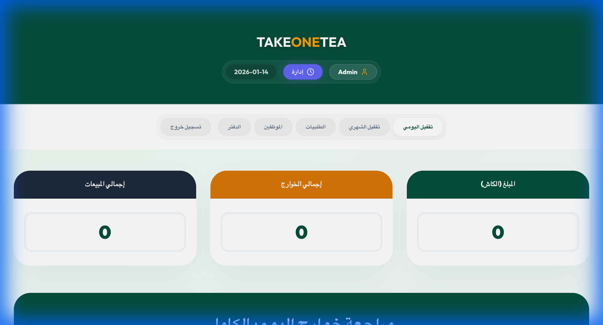
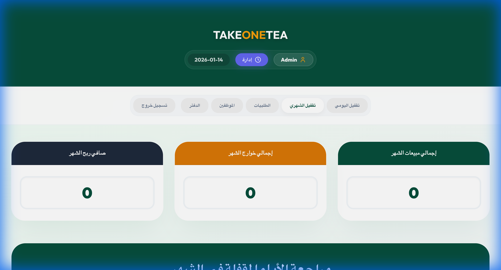
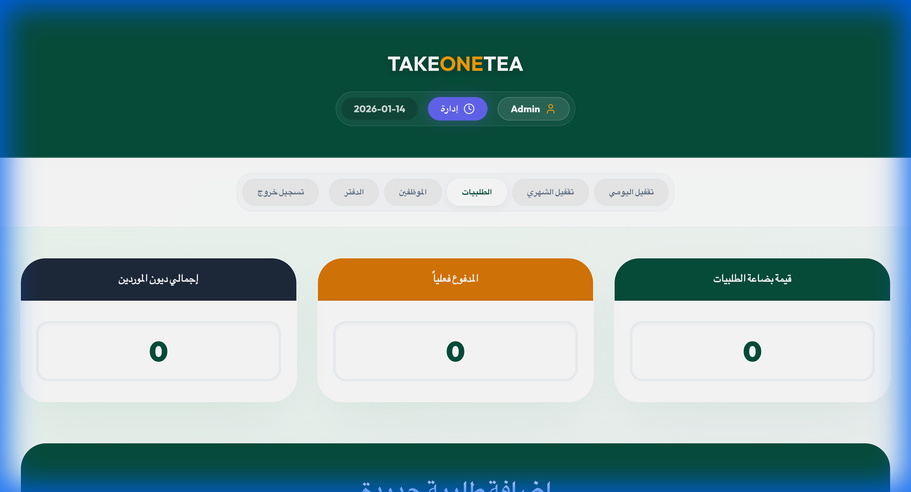
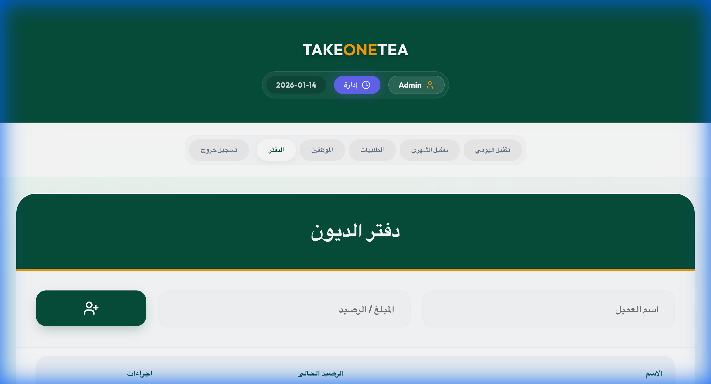
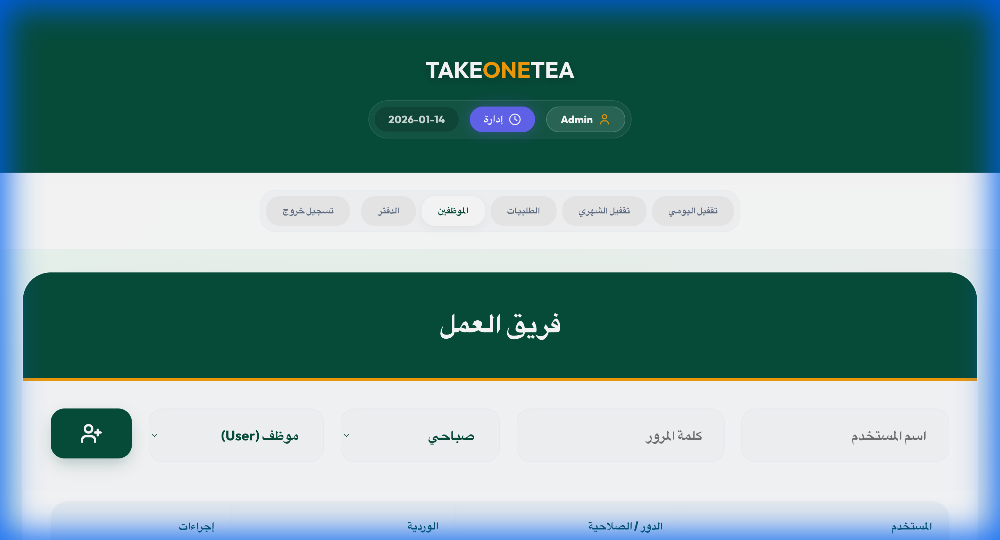

# T1T System - Pro Cafe Management Solution



A high-performance, secure, and visually stunning management system tailored for premium cafes and stores. Built with modern web technologies, it offers a seamless experience for tracking sales, managing expenses, and monitoring performance with surgical precision.

[](https://opensource.org/licenses/MIT)
[](https://reactjs.org/)
[](https://www.electronjs.org/)
[](https://supabase.io/)

## 🚀 Core Features

- **Dynamic Fiscal Month Management**: Custom billing cycles (e.g., from the 6th of each month to the 5th of the next) to match business operational realities.
- **Detailed Financial Logging**: Track every penny with categorized daily expenses, shift-based sales, and automated totals.
- **Inventory & Orders Hub**: Manage supplier orders, track payments versus price, and keep a clean inventory ledger.
- **Interactive Debtors Ledger (Notebook)**: A dedicated system for tracking customer debts with status updates (Unpaid/Partial/Paid).
- **Pro Analytics & Reporting**: Generate detailed Excel reports for daily shifts and monthly performance with a single click.
- **Role-Based Security**: Encrypted authentication for Super Admins and Staff, with protected management views.
- **Anti-Tamper Protection**: Disabled context menus and DevTools shortcuts to ensure system integrity during production.

## 🛠️ Technical Highlights

- **Real-time Cloud Sync**: Integrated with **Supabase** for instant data synchronization across multiple devices.
- **Offline Resilience**: Uses **Electron Store** for local data persistence, ensuring zero downtime even without internet.
- **Surgical Performance**: Optimized React rendering with **Framer Motion** for a smooth, app-like experience.
- **Financial Accuracy**: Custom-built Excel engine using **ExcelJS** for pixel-perfect accounting reports.

---

## 📸 System Walkthrough

### 1. Secure Authentication
The system uses SHA-256 salted hashing to ensure user credentials are never stored in plain text.


### 2. Daily Operations (Logger)
Efficiently record morning, evening, and night shifts. Integrated category selection for quick expense logging.


### 3. Monthly Performance Review
A birds-eye view of your business health. Analyze sales trends, expenses, and net profit over custom fiscal periods.


### 4. Supply Chain & Accounting
Track inventory orders and maintain a clear balance sheet with your suppliers.


### 5. The Digital Notebook (Debtors)
Replace old paper ledgers with a fast, searchable database of client debts.


### 6. User Management
Full control over staff accounts, roles (Super Admin/User), and shift assignments.


---

## 🛠️ Technical Stack

- **Frontend**: React.js with `framer-motion` for world-class animations.
- **Database**: Supabase (Cloud Sync) + Electron Store (Local Persistence).
- **Desktop**: Electron.js for the native experience on Windows and macOS.
- **Reporting**: `XLSX` and `ExcelJS` for professional financial exports.
- **Styling**: Vanilla CSS with a focus on premium Glassmorphism and dark themes.

---

## 📦 Build & Installation

### Development Mode
```bash
# Install dependencies
npm install

# Run the dev server (Web)
npm run dev

# Run in Electron (Desktop)
npm run electron:dev
```

### Production Build
```bash
# Build for Web
npm run build

# Build for Desktop (Installer)
npm run electron:build
```

---

## 🛡️ Security Protocol
- Context Menu: **Disabled**
- Inspect Element shortcuts: **Blocked**
- Password Hashing: **SHA-256 + Static Salt/Pepper**

---
*Developed with ❤️ for T1T Premium Cafe.*
